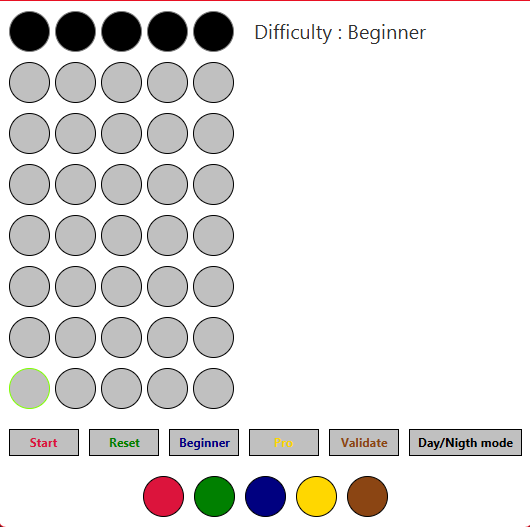
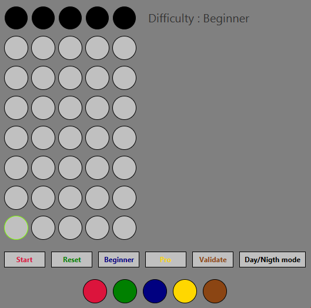
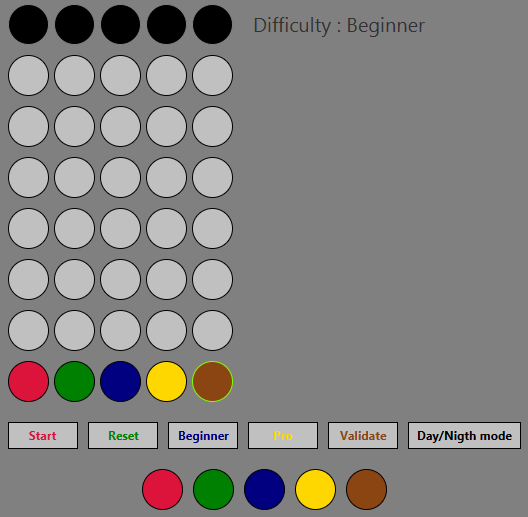
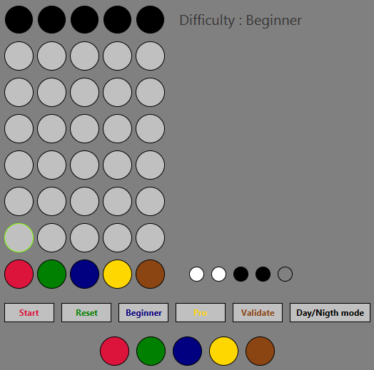
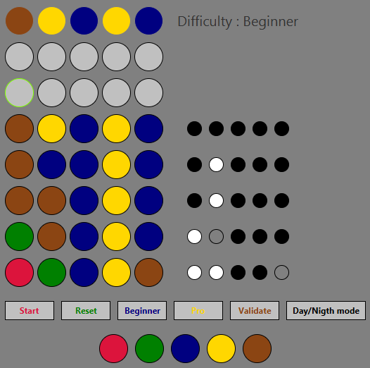

# Mastermind
You know the Mastermind board game ? This is the video game version

# Requirement

/!\ In order to run the game, you need to have at least Java 17 /!\

# Game interface
When you start the game, here is what you will see :

You can also switch to night mode with the button, then the game will look like this :

# Difficulty

In the game, the difficulty changes the correction display, making the game more difficult in pro mode.

## In Beginner mode :
- if a pon is well-placed, the correction will be a black pon
- if a pon is a good color, but wrong-placed, the correction will be a grey pon
- if a pon is of a color not present, the correction will be a white pon

## In Pro mode :
The principle is the same as the beginner mode, the only change is the order of the correction display :
- the black pon in first
- the grey pon then
- the white pon last

# How to play
To start playing, click "Start" and then fill your row pon with the color panel in the bottom.

You can always change back the color of a pon, until you validate the row.

When validating a row, the game will display the answer on it's right, like this :

In the example, there are 2 well-placed pon (in black) and one of the good color but wrong-placed (grey).

You can now continue to play until you either win, by discovering the combinaison, or loose by having 7 wrong attempts

Here, the game is won, the answer has been found before 7 attempts !

If you wish to continue playing, you can click "Reset" and play a new game.

# Credits
Game made by Timeuh, please ask before using this code